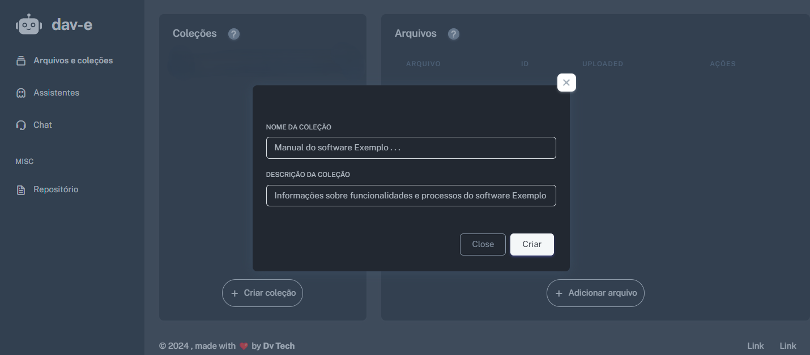
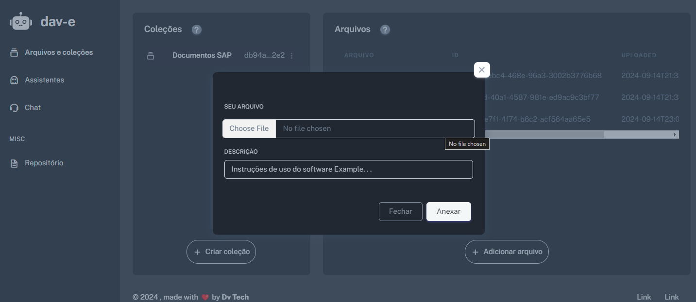
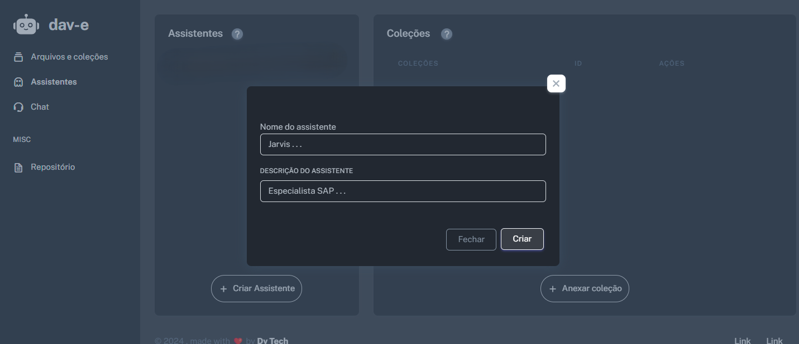
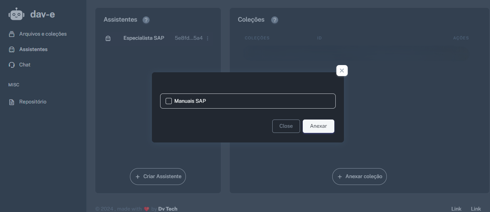
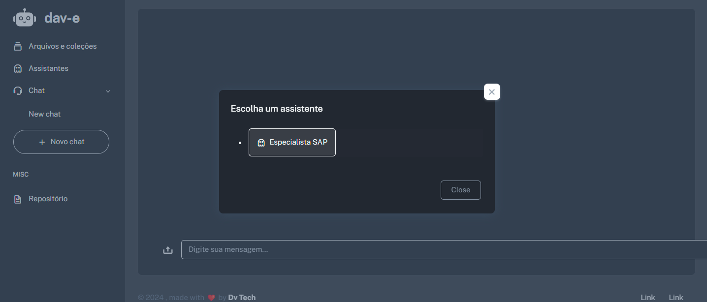
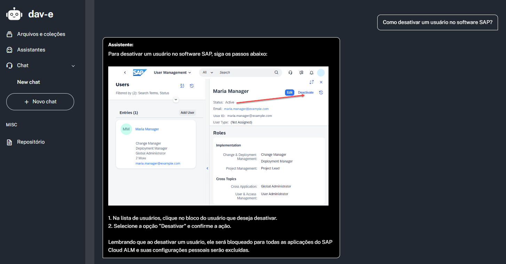

# Virtual Assistant Creation Simplified

This project aims to streamline the process of creating custom virtual assistants based on your own documents.
You can simply create an specialist in a determined area to help you in any situation.

## Key Features:

- **Document Upload & Collection**: Easily upload your relevant files and organize them into collections. Once done, you can launch a virtual assistant equipped with the knowledge from the documents you provided.

- **Multimodal Responses**: The assistant isn't limited to text; it can also respond with images you’ve uploaded, making interactions more engaging and effective.

- **Learning & Adaptation** *(In Development)*: The assistant learns continuously from its interactions, improving by recognizing mistakes and gaining insights over time.

## Built with:

- **[LangChain.js](https://js.langchain.com/v0.2/docs/introduction/)**: The project utilizes the LangChain.js library to simplify interactions with Large Language Models (LLMs), making it easier to build intelligent assistants.

- **[Chroma](https://www.trychroma.com/)**: To enhance the assistant's intelligence, a vector store is used to store document data and apply a Retrieval-Augmented Generation (RAG) approach, improving response quality by leveraging your custom documents.

- **[Express](https://expressjs.com/)**: For Routing

- **[Postgres](https://www.postgresql.org/)**: To relational database

## For the Future . . .
- API RESTFUL for integrations with another systems. 
- Make assistants more smart with better RAG approachs.
- Multi-assistants feature, that allow chat with more than one assistant at the same time.
- Implement any king of media retriever like video and audio to render in our chats.
- . . .  sorry, i'm so tired to complete that list now.

## How It Works

### 1. Creating a collection
To begin, you can create a collection.

### 2. Uploading a file
So, upload the relevant files that the assistant will use as its knowledge base.

### 3. Creating an assistant
Create an assistant based on your collections.

### 4. Attach a collection in the assistant

### 5. Lauching a chat
Launch a chat with one of your assistants, 

### 6. Send a message
Send a message, and see the magic happen!

